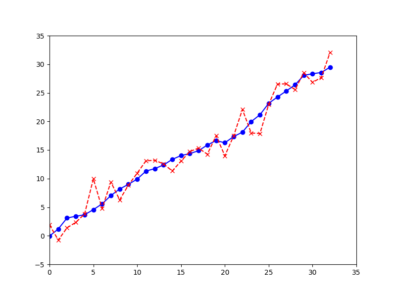
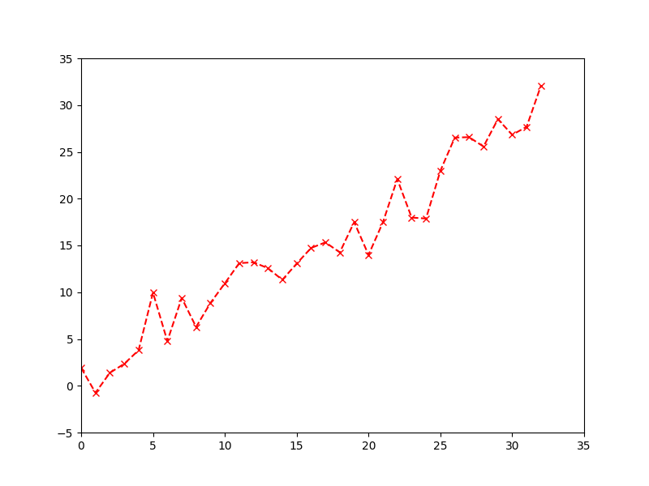
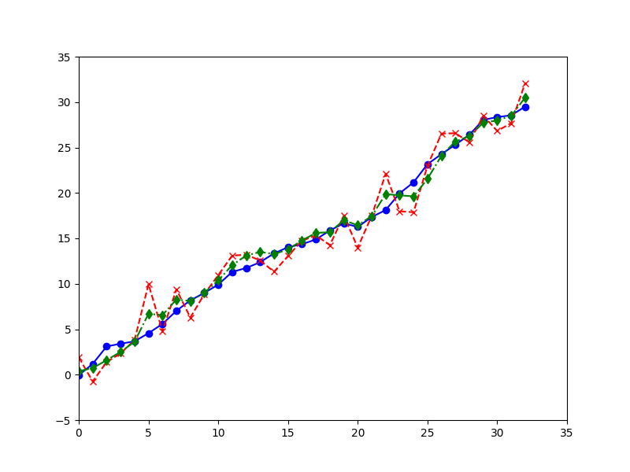
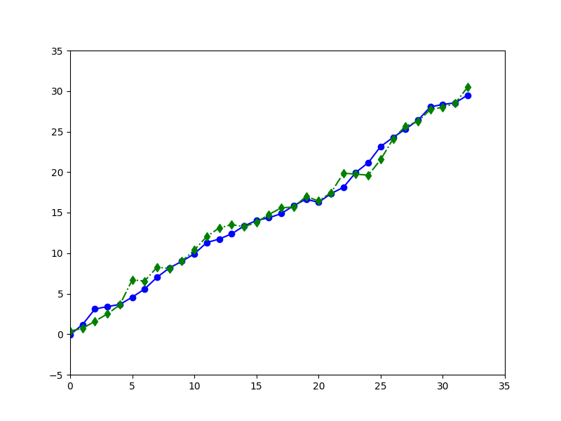
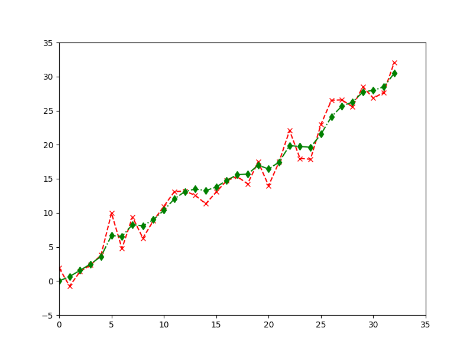

# カルマンフィルタの紹介

katatoshi

---

## このスライドについて

- カルマンフィルタはロボットの自己位置推定など，時系列データから雑音を取り除くアルゴリズム
- このスライドでは，簡単なロボットのシミュレーションを例に，カルマンフィルタでどういったことができるのかについて紹介する

---

## カルマンフィルタの概要

- カルマンフィルタは時系列データから雑音を取り除くアルゴリズム
  - 時系列データの例: 毎秒のセンサ値のデータ
- カルマンフィルタは「観測されたデータには雑音が含まれており，真の値はその背後に隠れている」という状況に適用できる
  - ロボットが観測した距離データには雑音が含まれており，ロボットの位置 (真の値) はその背後に隠れている
- カルマンフィルタを使うと，観測データから真の値を推定できる

---

## 簡単なロボットの例

- 直線上を移動するロボット
- ロボットは自分の位置は分からないが，目印からの距離を観測できる
- 目印からの距離の観測値には誤差があり，実際の距離からランダムにズレたものになる
- ロボットは移動量を指令として受け取る
- ロボットは指令通り移動しようとするが，路面状況等により，指令からランダムにズレた位置に移動してしまう

---


---

## 簡単なロボットのシミュレーション

- 簡単なロボットを Python でシミュレーション (simple_robot.py)
- ロボットを `SimpleRobot` クラスで表現
- 現在の位置 `x` と最新の観測値 `y` を属性として持つ
  - 実際には，現在の位置 `x` はロボットにはわからないが，シミュレーションのために `SimpleRobot` クラスに持たせてある

```python
class SimpleRobot

    def __init__(self, x_0: float, S: float, Q: float, R: float):
        self.x = x_0 + rng.normal(0.0, S)
        self.y = 0.0 # まだ何も観測していないということ (0.0 という値に意味はない)
        self.Q = Q
        self.R = R
```

---

## ロボットの初期位置

- ロボットの初期位置は指定値からランダムにズレた位置になるとする
  - 指定された位置に設置しようとしたがズレてしまった等
```python
    def __init__(self, x_0: float, S: float, Q: float, R: float):
        self.x = x_0 + rng.normal(0.0, S)
        self.y = 0.0 # まだ何も観測していないということ (0.0 という値に意味はない)
        self.Q = Q
        self.R = R
```
- `x_0` が指定値
- `rng.normal` で正規分布に従う乱数を生成
  - `rng.normal(0.0, S)` は平均 `0.0`，分散 `S` の正規分布に従う乱数
  - 平均 `0.0` はズレの中心を表している
  - 分散 `S` はズレの大きさを表している

---

## 距離の観測と移動

- 目印からの距離の観測は `observe` メソッドで表現
```python
    def observe(self) -> None:
        v = rng.normal(0.0, self.R)
        self.y = self.x + v
```
- `v` が誤差を表すランダムなズレ
  - コンストラクタで定義していた属性 `R` は `v` の分散
- ロボットの移動は `move` メソッドで表現
```python
    def move(self, u: float) -> None:
        w = rng.normal(0.0, self.Q)
        self.x = self.x + u + w
```
- `u` が指令 (移動量) で `w` がランダムなズレ
  - コンストラクタで定義していた属性 `Q` は `w` の分散

---

## ロボットの動き

- `SimpleRobot` ロボットは，インスタンスが生成されたタイミングで，指定値の周辺に設置される (初期位置)
- インスタンスが生成された後は，`observe` で観測して `move` で移動，という流れを繰り返す
- 設定されたゴールを超えたならシミュレーションを終了する

---

## シミュレーションの流れ

```python
# x_0=0.0, S=0.5 で，初期位置は 0.0 周辺であることを表す
# Q=0.5, R=2.0 で，移動時のズレに比べて，観測値の誤差が大きいことを表す
simple_robot = SimpleRobot(x_0=0.0, S=0.5, Q=0.5, R=2.0)
goal = 30.0 # ループを抜けるためにゴールを設定
while True:
    # ここが移動後のタイミング (初回は初期位置に設置されたタイミング)
    x = simple_robot.x # ロボットの位置
    simple_robot.observe() # 距離を観測させる
    y = simple_robot.y # 距離の観測値
    if y >= goal: # 実際には，ロボットには真の位置が分からないので，観測値でゴールに到達したか判断
        break # ゴールを超えているなら終わり

    u = 1.0 # 1.0 移動せよという指令
    simple_robot.move(1.0) # 指令を渡して移動させる
```

---

## シミュレーションの実行

- simple_robot.py を実行した画面を参照

---

## シミュレーションの結果

- 「<span class="blue">⚫︎</span>」(実線) がロボットの位置 `x`
- 「<span class="red">×</span>」(破線) が距離の観測値 `y`



---

## 距離の観測値のみの結果

- 今回はシミュレーションなのでロボットの位置がわかっているが，実際に利用できるのは距離の観測値のみ 
- ロボットの位置は距離の観測値から推定するしかない



---

## カルマンフィルタで観測値から位置を推定する

- 先ほどの例でカルマンフィルタを使って，距離の観測値からロボットの位置を推定 (kalman_filter.py)
- コードの説明は後にして，まずは実行してみる

---

## カルマンフィルタの結果

- 「<span class="blue">⚫︎</span>」(実線) がロボットの位置
- 「<span class="red">×</span>」(破線) が距離の観測値
- 「<span class="green">♦︎</span>」(鎖線) がカルマンフィルタの推定値



---

## ロボットの位置と推定値

- カルマンフィルタの推定値はロボットの位置をよく再現している
- カルマンフィルタの推定値の計算には，ロボットの位置はまったく使用していない，ということがポイント



---

## 距離の観測値と推定値

- カルマンフィルタの推定値は観測値のブレを押さえたような動きをしている



---

## カルマンフィルタのアルゴリズムの前に

- カルマンフィルタが適用できる状態のおさらい
- カルマンフィルタは「観測されたデータには雑音が含まれており，真の値はその背後に隠れている」という状況に適用できる

---

## カルマンフィルタが適用できる状況

- もう少し詳しくいうと，次のような状況
- 観測値 $y$ は真の値 $x$ に誤差 (ズレ) $v$ を加えた値である:
$$
y = x + v
$$
- 真の値 $x$ は指令 $u$ とズレ $w$ を加えた値 $x'$ に推移する:
$$
x' = x + u + w
$$
- 真の値の初期値は指定値にズレを加えた値である
- ちょうど，簡単なロボットの例と同じ状況
  - そうなるように簡単なロボットの例を作った
  - 実際には，解決したい問題をどうやって，このような状況に落とし込むのか (そもそも落とし込めるのか) 考える必要がある
- カルマンフィルタはこのような状況を前提としたアルゴリズム

---

## カルマンフィルタのアルゴリズム

- カルマンフィルタを `KalmanFilter` クラスで実装
- 予測推定値 `x_p` とフィルタリング推定値 `x_f` を属性として持つ
  - 予測推定誤差の分散 `P_p` とフィルタリング推定誤差の分散 `P_f` も属性として持つ
  - これまでカルマンフィルタの推定値と呼んでいたものは，フィルタリング推定値
```python
class KalmanFilter:

    def __init__(self, x_0: float, S: float, Q: float, R: float):
        self.x_p = x_0
        self.P_p = S
        self.x_f = 0.0 # まだ何もフィルタリングしていないということ (0.0 という値に意味はない)
        self.P_p = 0.0 # まだ何もフィルタリングしていないということ (0.0 という値に意味はない)
        self.Q = Q
        self.R = R
```
- カルマンフィルタは予測推定値 `x_p` (及び `P_p`) とフィルタリング推定値 `x_f` (及び `P_f`) を交互に更新するアルゴリズム

---

## 予測推定値の初期値

- アルゴリズムの最初のステップでは，予測推定値 `x_p` (及び `P_p`) の初期値を設定する
- この時点では，真の値の初期値は指定値からランダムにズレた値になることしか分からないので，この指定値を予測推定値の初期値とする
  - 予測推定誤差 `P_p` の初期値は，指定値からのズレの分散とする
  - まだ何も観測していないときに，次の真の値を予測 (prediction) している
```python
    def __init__(self, x_0: float, S: float, Q: float, R: float):
        self.x_p = x_0
        self.P_p = S
        self.x_f = 0.0 # まだ何もフィルタリングしていないということ (0.0 という値に意味はない)
        self.P_p = 0.0 # まだ何もフィルタリングしていないということ (0.0 という値に意味はない)
        self.Q = Q
        self.R = R
```
- なお，`Q` と `R` は簡単なロボットの例同様，観測誤差と指令からのズレの分散

---

## フィルタリング推定値の更新

- 観測値 `y` が得られたら，`filter` メソッドでフィルタリング推定値を更新
```python
    def filter(self, y: float) -> None:
        K = self.P_p / (self.P_p + self.R) # カルマンゲイン
        self.x_f = self.x_p + K * (y - self.x_p)
        self.P_f = self.P_p - K * self.P_p
```
- 現在までの観測値を使って，現在の真の値を推定することをフィルタリング (filtering) という
  - 現在の観測値 `y` しか使っていないように見えるが，予測推定値 `x_p` にこれまでの観測値が反映されている
- `K` はカルマンゲインと呼ばれるもので，観測値と予測推定値の差 (予測誤差) `y - x_p` を `K` 倍すると，フィルタリング推定値と予測推定値の差 `x_f - x_p` になる
  - 信号処理等の知識がないので間違っているかもしれないが，`K` は入力 `y - x_p` と出力 `x_f - x_p` の比なので，確かに「ゲイン」を表していると言えるはず

---

## 予測推定値の更新

- 指令 `u` を受け取ったら，`predict` メソッドで予測推定値を更新
```python
    def predict(self, u: float) -> None:
        self.x_p = self.x_f + u
        self.P_p = self.P_f + self.Q
```
- 現在までの観測値を使って，次の真の値を推定しているので予測 (prediction) という
- 真の値は $x' = x + u + w$ で推移する状況を前提としているので，ズレ $w$ は平均的には $0$ なら，次の真の値は $x + u$ だろうと推測している，ということだと解釈することもできる
- 現在の真の値 $x$ は実際には分からないので，このタイミングで，これまでの情報を最も反映している，フィルタリング推定値を代わりに使い，`x_f + u` を予測推定値とする
  - 予測推定誤差の分散 `P_p` も同じように考えることができる
    - $x$ と $w$ が独立なら $x + u + w$ の分散 $P_p$ は $x$ の分散 $P_f$ と $w$ の分散 $Q$ の和なので $P_p = P_f + Q$ となる．$u$ はランダムではないので分散には現れない
- 予測推定値は前提としている状況を利用して，次の真の値を予測しているということ

---

## カルマンフィルタの流れ

- `KalmanFilter` は，対象とする状況と同じパラメータ (初期の真の値の設定値と各種ズレの分散) で初期化することで，対象とする状況を表現できるようになる
- 初期化された後は，観測値が得られたら `filter` でフィルタリング推定値を更新，指令を受け取ったら `predict` で予測推定値を更新，という流れを繰り返す

---

## 簡単なロボットの例でのカルマンフィルタ
```python
simple_robot = SimpleRobot(x_0=0.0, S=0.5, Q=0.5, R=2.0)
# simple_robot と同じパラメータを渡して，simple_robot に対応するカルマンフィルタを作る
kalman_filter = KalmanFilter(x_0=0.0, S=0.5, Q=0.5, R=2.0)
goal = 30.0
while True:
    x = simple_robot.x
    # x_p = kalman_filter.x_p # ロボットの位置の予測推定値 (ここでは使わない)
    simple_robot.observe()
    y = simple_robot.y
    kalman_filter.filter(y) # 観測値を使ってフィルタリング推定値を更新
    x_f = kalman_filter.x_f # ロボットの位置のフィルタリング推定値
    if y >= goal:
        break

    u = 1.0
    simple_robot.move(u)
    kalman_filter.predict(u) # 指令を渡して予測推定値を更新
```

---

## 発展的な話題

- なんであの式でいいのかはちゃんと数学的に証明できる
  - というかそれが気になって勉強していた
- 今回は1次元だけど多次元でも使える　というか大抵の場合多次元になる
- カルマンフィルタが適用できる状況は，より一般には $y = H x + v, x' = F x + E u + G w$ ($E, F, G, H$ は定数) という状況．今回は一番簡単な定数がすべて $1$ のケースのみ扱った
- さらに一般の $y = h(x) + v, x' = f(x, u) + G w$ といった状況ではカルマンフィルタは使えないが，拡張カルマンフィルタやパーティクルフィルタなどが使える

---

## まとめ

- カルマンフィルタを使うと雑音を含む観測値から真の値が推定できることをシミュレーションで紹介した
- カルマンフィルタには，観測値を利用した推定値の更新ステップと，真の値の推移法則を利用した推定値の更新ステップがある
- 観測値を利用した推定値の更新ステップでは，更新前の推定誤差と観測誤差の大きさに応じて，更新前の推定値と観測値をそれぞれどの程度信用するか　というかいい感じに混ぜて推定値としている　って言いたい
- カルマンフィルタは今回のケースよりもう少し一般のケースでも使えるが，さらに一般的なケースでは近似手法を使う必要がある

---

## 参考文献
