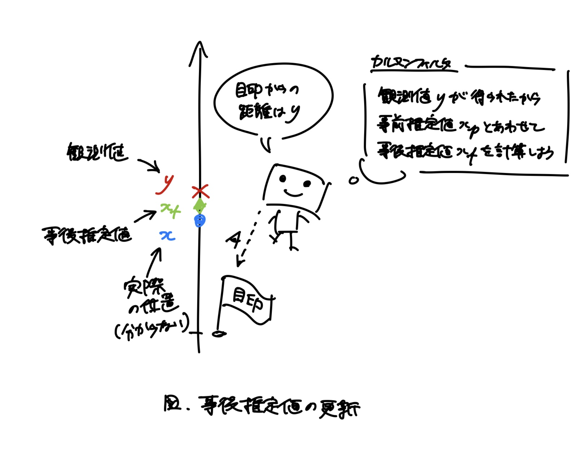

# カルマンフィルタの紹介

katatoshi

---

## このスライドの目的

- カルマンフィルタはロボットの自己位置推定などで使われるアルゴリズム
- 簡単なロボットのシミュレーションを通して，カルマンフィルタについて紹介する

---

## カルマンフィルタの概要

- カルマンフィルタは
  - ロボットの自己位置推定
  - ロケットの軌道推定と軌道制御
  - リチウムイオン二次電池の状態推定
- などで使われるアルゴリズム
- カルマンフィルタを使うと，観測値から真の値を推定することができる
  - ロボットなら，目印からの距離の観測値から自身の位置を推定することができる

---

## 簡単なロボットの例: 初期位置

- 直線上を移動するロボット
- 最初に，ロボットを指定位置に設置しようとするが，指定位置が分かりにくい等の理由により，初期位置は指定位置からランダムにズレたものになる


---

## 簡単なロボットの例: 観測

- ロボットは自分の位置は分からないが，目印からの距離を観測できる
- 目印からの距離の観測値には誤差があり，実際の距離からランダムにズレたものになる


---

## 簡単なロボットの例: 移動

- ロボットは移動量を指令として受け取る
- ロボットは指令通り移動しようとするが，路面状況等により，指令からランダムにズレた位置に移動してしまう


---

## 簡単なロボットのシミュレーション

- 簡単なロボットを Python でシミュレーション (simple_robot.py)
- ロボットは `Robot` クラスで表現
- 現在の位置 `x` と最新の観測値 `y` を属性として持つ

```python
class Robot

    def __init__(self, x_0: float, S: float, Q: float, R: float):
        w = rng.normal(0.0, S)
        self.x = x_0 + w
        self.y = 0.0
        self.Q = Q
        self.R = R
```

---

## ロボットの初期位置

```python
    def __init__(self, x_0: float, S: float, Q: float, R: float):
        w = rng.normal(0.0, S)
        self.x = x_0 + w
        self.y = 0.0
        self.Q = Q
        self.R = R
```
- `x_0` が指定位置
- `w` がランダムなズレ
  - `rng.normal(0.0, S)` は平均 `0.0`，分散 `S` の正規分布に従う乱数
  - 平均 `0.0` はどの辺りを中心にズレるのかを表している
  - 分散 `S` は中心からどれくらいズレ得るのかを表している

---

## 目印からの距離の観測

- `observe` メソッドで目印からの距離を観測する
```python
    def observe(self) -> None:
        v = rng.normal(0.0, self.R)
        self.y = self.x + v
```
- `v` が誤差を表すランダムなズレ
  - コンストラクタで定義していた属性 `R` は `v` の分散

---

## ロボットの移動

- `move` メソッドでロボットを移動させる
```python
    def move(self, u: float) -> None:
        w = rng.normal(0.0, self.Q)
        self.x = self.x + u + w
```
- `u` が指令 (移動量) で `w` がランダムなズレ
  - コンストラクタで定義していた属性 `Q` は `w` の分散

---

## シミュレーションの流れ

```python
# x_0=0.0, S=0.5 なので，初期位置は 0.0 周辺
# Q=0.5, R=2.0 なので，指令からのズレより観測誤差の方が大きい
robot = Robot(x_0=0.0, S=0.5, Q=0.5, R=2.0)
goal = 30.0 # ループを抜けるためにゴールを設定
while True:
    x = robot.x # ロボットの位置
    robot.observe() # 目印からの距離を観測させる
    y = robot.y # 目印からの距離の観測値
    if y >= goal: # 観測値でゴールに到達したか判断する
        break # ゴールを超えていたら終わり

    u = 1.0 # 1.0 移動するという指令
    robot.move(u) # 指令を渡してロボットを移動させる
```

---

## シミュレーションの実行

- simple_robot.py を実行すると...

---

## シミュレーションの結果

- 「<span class="blue">●︎</span>」(実線) がロボットの位置 `x`
- 「<span class="red">×</span>」(破線) が距離の観測値 `y`


---

## 距離の観測値だけの結果

- 今回はシミュレーションなのでロボットの位置がわかっているが，実際には，距離の観測値しか分からない
- ロボットの位置は距離の観測値から推定するしかない


---

## カルマンフィルタでロボットの位置を推定

- 今回の簡単なロボットのような動きをするものには，カルマンフィルタを使うことができる
- カルマンフィルタを使うと，距離の観測値からロボットの位置を推定することができる

---

## カルマンフィルタの実行

- kalman_filter.py は simple_robot.py にカルマンフィルタの実装を追加したもの
- kalman_filter.py を実行すると...

---

## カルマンフィルタの結果

- 「<span class="blue">●</span>」(実線) がロボットの位置
- 「<span class="red">×</span>」(破線) が距離の観測値
- 「<span class="green">♦︎</span>」(鎖線) がカルマンフィルタの推定値


---

## ロボットの位置と推定値

- カルマンフィルタの推定値はロボットの位置をよく再現している
- この推定値の計算にロボットの位置は使っていない


---

## 距離の観測値と推定値

- カルマンフィルタの推定値は観測値の大きな動きを押さえたような動きをしている


---

## カルマンフィルタのアルゴリズム

- カルマンフィルタでは，ロボットの位置の**事前推定値**と**事後推定値**という，2つの推定値が登場する
- この2つの推定値を交互に更新しながら，ロボットの位置を推定する
- 「カルマンフィルタの推定値」と呼んでいたものは，事後推定値の方

---

## カルマンフィルタ: 初期化

- ロボットが設置された直後は，指定位置 $x_0$ しかないので，これを事前推定値 $x_p$ の初期値とする


---

## カルマンフィルタ: 事後推定値

- 観測値 $y$ が得られたら，事前推定値 $x_p$ と合わせて，事後推定値 $x_f$ を計算，更新する
- 観測値が得られた後だから「事後」



---

## カルマンフィルタ: 事前推定値

- 指令 (移動量) $u$ が与えられたら，事後推定値 $x_f$ から次の事前推定値 $x_f$ を計算，更新する
- 観測値が得られる前だから「事前」


---

## カルマンフィルタの実装

- kalman_filter.py
- カルマンフィルタは `KalmanFilter` クラスで実装
- 事前推定値 `x_p` と事後推定値 `x_f` を属性として持つ
  - `P_p` は事前推定誤差，`P_f` は事後推定誤差を表す
```python
class KalmanFilter

    def __init__(self, x_0: float, S: float, Q: float, R: float):
        self.x_p = x_0
        self.P_p = S
        self.x_f = 0.0
        self.P_f = 0.0
        self.Q = Q
        self.R = R
```

---

## カルマンフィルタの初期化

```python
    def __init__(self, x_0: float, S: float, Q: float, R: float):
        self.x_p = x_0
        self.P_p = S
        self.x_f = 0.0
        self.P_f = 0.0
        self.Q = Q
        self.R = R
```
- コンストラクタの引数には，ロボットと同じ値が入ることを想定している
- 事前推定値 `x_p` を指定位置 `x_0` で初期化する
  - 事前推定誤差 `P_p` は指定位置からのズレの分散 `S` で初期化する

---

## 事後推定値の更新

- `filter` メソッドで事後推定値を更新する
```python
    def filter(self, y: float) -> None:
        K = self.P_p / (self.P_p + self.R)
        self.x_f = self.x_p + K * (y - self.x_p)
        self.P_f = self.P_p - K * self.P_p
```
- 観測値 `y` と事前推定値 `x_p` から事後推定値 `x_f` を計算して更新する
  - 計算式の意味は付録を参照
- `K` はカルマンゲインと呼ばれる

---

## 事前推定値の更新

- `predict` メソッドで事後推定値を更新する
```python
    def predict(self, u: float) -> None:
        self.x_p = self.x_f + u
        self.P_p = self.P_f + self.Q
```
- 指令 `u` と事後推定値 `x_f` から事前推定値 `x_p` を計算して更新する
- 事後推定値 `x_f` から指令 `u` だけ進んだ位置を，次の事前推定値 `x_p` としているだけ

---

## カルマンフィルタのアルゴリズムの流れ

```python
robot = Robot(x_0=0.0, S=0.5, Q=0.5, R=2.0)
# robot と同じパラメータの値で kalman_filter を作る
kalman_filter = KalmanFilter(x_0=0.0, S=0.5, Q=0.5, R=2.0)
goal = 30.0
while True:
    x = robot.x
    x_p = kalman_filter.x_p # ロボットの位置の事前推定値
    robot.observe()
    y = robot.y
    kalman_filter.filter(y) # 観測値が得られたので事後推定値を更新
    x_f = kalman_filter.x_f # ロボットの位置の事後推定値
    if y >= goal:
        break

    u = 1.0
    robot.move(u)
    kalman_filter.predict(u) # 指令を渡して事前推定値を更新
```

---

## カルマンフィルタが使える範囲

- 今回は
$$
\begin{align*}
x' & = x + u + w \\
y & = x + v
\end{align*}
$$
- という動きをするロボットにカルマンフィルタを使った
- より一般に，$F, G, H$ を定数として
$$
\begin{align*}
x' & = F x + u + G w \\
y & = H x + v
\end{align*}
$$
- といった動きをするものにもカルマンフィルタを使うことができる
- さらに，今回は $x$ も $y$ も数値 (1次元) だったが，ベクトル (多次元) の場合でも，同じようにカルマンフィルタを使うことができる

---

## カルマンフィルタが使えないもの

- 一方，次のような動きをするものにはカルマンフィルタは使えない
$$
\begin{align*}
x' & = \sin(x) + u + w \\
y & = x^2 + v
\end{align*}
$$
- このような場合，カルマンフィルタから派生した別のアルゴリズムを使わないといけない
  - 拡張カルマンフィルタ，パーティクルフィルタ等
- 最初に紹介したロケットとリチウムイオン二次電池の例は，どちらもこのケース
  - ロボットの例も，平面を動くロボットになるとこのケースになる

---

## まとめ

- カルマンフィルタは事前推定値と事後推定値を交互に更新して，観測値から真の値を推定するアルゴリズム
- 実際に，カルマンフィルタを使うと，距離の観測値からロボットの位置を推定できた
- カルマンフィルタが使えるケースは広いが，使えないケースもある

---

## 付録: 正規分布ってなんだっけ？

- 右図のような左右対称な釣り鐘型の分布
  - 分布の見方は，グラフの高いところの方が起こりやすいと思ってよい
- 式で書くと次のような分布
$$
\varphi(x; \mu, \Sigma) = \frac{1}{\sqrt{2 \pi \Sigma}} e^{-\frac{1}{2 \Sigma}(x - \mu)^2}
$$
- 平均 $\mu$ と分散 $\Sigma$ で形状が決まる
  - 右図は $\mu = 0, \Sigma = 1$ のときの分布
- 色々と良い性質があってありがたい


---

## 付録: 平均と分散ってなんだっけ？

- **平均**は分布の「中心」を表す量
  - 正規分布なら，分布の対称軸の位置が平均 (右上図の $\mu$)
- **分散**は平均からの「ばらつき」を表す量
  - 例えば，分散が $\Sigma = 1, 2, \frac{1}{2}$ の正規分布は右下図のようになり，分散が大きくなるほど，分布が広がっていることがわかる


---

## 付録: 事後推定値の計算式

- `filter` メソッドで事後推定値を更新する
```python
    def filter(self, y: float) -> None:
        K = self.P_p / (self.P_p + self.R) # カルマンゲイン
        self.x_f = self.x_p + K * (y - self.x_p)
        self.P_f = self.P_p - K * self.P_p
```
- カルマンゲインを変形すると `K = 1 / (1 + R / P_p)`
- つまり，観測誤差 `R` が小さくなるとカルマンゲイン `K` は大きくなり，事前推定誤差 `P_p` が小さくなるとカルマンゲイン `K` は小さくなる
- 事後推定値を変形すると `x_f = K * y + (1 - K) * x_p`
- つまり，カルマンゲイン `K` が大きいほど観測値 `y` を重視して，カルマンゲイン `K` が小さいほど事前推定値 `x_p` を重視する
- まとめると，事後推定値は観測値と事前推定値の加重平均で，観測誤差が小さいほど観測値を重視し，事前推定誤差が小さいほど事前推定値を重視する

---

## 付録: 線形・非線形

- 関数 $f$ が
  1. $f(x + y) = f(x) + f(y)$
  1. $f(a x) = a f(x)$
- をみたすとき，$f$ は**線形**であるという
  - 例えば，$f(x) = 2 x$ は線形な関数
- 関数 $f$ が線形でないとき，**非線形**であるという
  - 例えば $f(x) = x^2$ は非線形な関数 ($\because f(1 + 1) = f(2) = 4 \neq 1 + 1 = f(1) + f(1)$)
- 線形・非線形という言葉を使うと「カルマンフィルタは線形な動きをするようなものに使うことができ，非線形な動きをするものには使えない」と言える

---

## 参考文献

- 足立 修一，丸田 一郎『カルマンフィルタの基礎』東京電機大学出版局，2012
- 上田 隆一『詳解 確率ロボティクス Pythonによる基礎アルゴリズムの実装』講談社，2019
- 片山 徹『非線形カルマンフィルタ』朝倉書店，2011
- 片山 徹「非線形カルマンフィルタの基礎」計測と制御，2017年56巻9号 p.638-643
  - https://www.jstage.jst.go.jp/article/sicejl/56/9/56_638/_pdf/-char/ja (pdf)
- 野村 俊一『カルマンフィルタ―Rを使った時系列予測と状態空間モデル―』共立出版，2016
