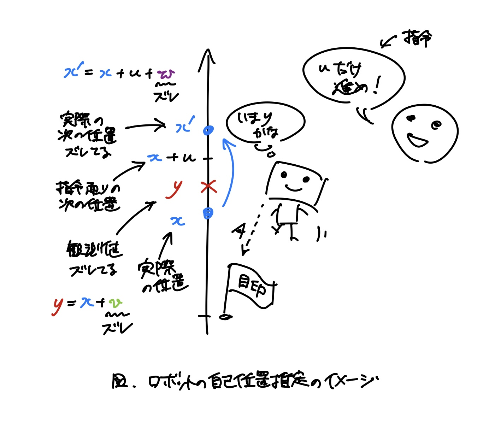
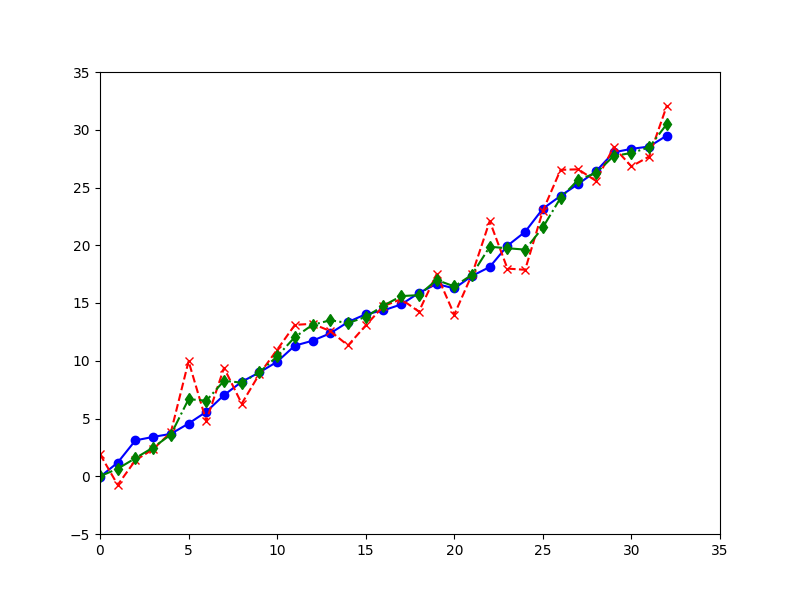
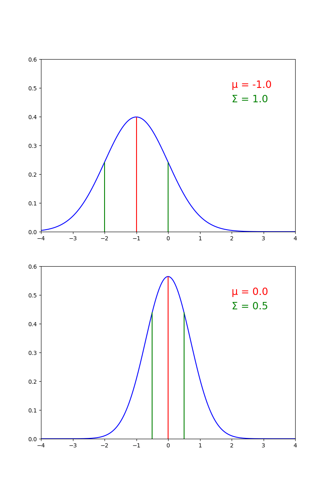

<!-- _class: centered -->

# カルマンフィルタの紹介

katatoshi

---

## そもそもカルマンフィルタって何？

- **カルマンフィルタ**は，観測データからその背後に隠れている情報を推定するアルゴリズム
- データから雑音を取り除くアルゴリズムとも言える

---

## カルマンフィルタの応用例

- センサ値などの時系列データのノイズ除去
- ロボットの自己位置推定
- ロケットの軌道推定と軌道制御 (アポロ計画)
- etc.

---

## ロボットの自己位置推定の例

- 直線上を前身か後退しかできないロボットについて考える
- ロボットは移動量を指令として受け取り，指令通り進もうとする
- 実際の移動量は，路面状況等により，指令からランダムにズレたものになる
- ロボットは自分の位置を目印からの距離等によって推定しようとする
- 目印からの距離等には誤差があり，真の値からランダムにズレたものになる

---



---

## ロボットの自己位置推定のシミュレーション

- `simple-self-localization.py` を参照
- `Robot`: ロボットのクラス
- `observe`: 距離を観測する．`rng.normal` の部分が誤差
```python
    def observe(self) -> None:
        self.y = self.x + rng.normal(0, self.R)
```
- `move`: 指令 `u` に従って動く．`rng.normal` の部分が指令からのズレ
```python
    def move(self, u: float) -> None:
        self.x = self.x + u + rng.normal(0, self.Q)
```
- `self.R`, `self.Q` は観測の誤差と指令からのズレの大きさに対応する

---

## シミュレーションの流れ

```python
# ロボットオブジェクトを作成
# Q=0.5, R=2.0 で，指令からはそんなにズレないけど，観測誤差はそれなりにあることを表す
# mean_x_0=0.0, Sigma=0.5 で，初期位置は 0.0 の辺りであることを表す
robot = Robot(Q=0.5, R=2.0, mean_x_0=0.0, Sigma=0.5)
goal = 30.0 # ゴール
while True:
    x = robot.x # ロボットの実際の位置
    robot.observe() # 目印からの距離を観測させる
    y = robot.y # 観測値
    if y >= goal:
        break # 観測値がゴールを超えてたら終わり

    u = 1.0 # 毎ループ 1.0 ずつ進むような指令
    robot.move(u) # 指令を与えてロボットを動かす
```

---

## シミュレーションを実行してみる

- 実行画面を参照

---

## シミュレーション実行結果

- 実線が実際の位置 (`x`)
- 破線が観測値 (`y`)
- 観測値が実際の位置からズレていることがわかる


---

## 実際に観測できる値

- 現実では，実際の位置は分からない
- 観測値のみから実際の位置を推定する必要がある


---

## カルマンフィルタで位置を推定

- `simple-self-localization-with-kalman-filter.py` を参照
- `KalmanFilter` クラスでパラメータ (`F`, `G`, `H`, `Q`, `R`) を保持
- `filter` メソッドと `predict` メソッドで `(x_p, P_p)` と `(x_f, P_f)` を交互に更新
- `filter` メソッドで観測値 `y` を反映している
```python
    def filter(self, x_p: float, P_p: float, y: float) -> Tuple[float, float]:
        K = P_p * self.H / (P_p * (self.H ** 2) + self.R) # カルマンゲイン
        x_f = x_p + K * (y - self.H * x_p)
        P_f = P_p - K * self.H * P_p
        return (x_f, P_f)
    
    def predict(self, x_f: float, P_f: float, u: float) -> Tuple[float, float]:
        x_p = self.F * x_f + u
        P_p = (self.F ** 2) * P_f + (self.G ** 2) * self.Q
        return (x_p, P_p)
```

---

## カルマンフィルタを実行してみる

- 実行画面を参照

---

## カルマンフィルタ実行結果

- カルマンフィルタの推定値 (鎖線) は観測値 (破線) より，実際の位置 (実線) に近い動きをしている



---

## カルマンフィルタと実際の位置

- カルマンフィルタの推定値 (鎖線) は実際の位置 (実線) をよく再現している


---

## カルマンフィルタと観測値

- カルマンフィルタの推定値 (鎖線) は観測値 (破線) のズレが大きい箇所を押さえているように見える
- カルマンフィルタの推定値はこの観測値のみから計算していることに注目
  - 実際の位置はまったく計算に使っていない


---

## カルマンフィルタの流れ

```python
robot = Robot(Q=0.5, R=2.0, mean_x_0=0.0, Sigma=0.5)
# カルマンフィルタオブジェクトを作る
# F=1.0, G=1.0, H=1.0 とすると Robot と同じモデルになる
# Q=0.5, R=2.0 は Robot の Q, R に対応させている
kalman_filter = KalmanFilter(F=1.0, G=1.0, H=1.0, Q=0.5, R=2.0)
goal = 30.0
# 初期値: x_p, P_p の初期値は Robot の初期位置 mean_x_0, Sigma に対応させている
# なお，x_p は予測推定値，P_p は x_p の推定精度を表している (_p は prediction の意味)
(x_p, P_p) = (0.0, 0.5)
while True:
    x = robot.x
    robot.observe()
    y = robot.y
    # 観測更新: 現在の予測推定値 x_p, P_p と観測値 y から，フィルタリング推定値 x_f, P_f を計算
    # フィルタリングとは，観測値を使って予測推定値のノイズを取り除くこと (_f は filtering の意味)
    (x_f, P_f) = kalman_filter.filter(x_p, P_p, y)
    if y >= goal:
        break

    u = 1.0
    robot.move(u)
    # 時間更新: フィルタリング推定値 x_f, P_f と指令 u を使って，次の予測推定値を計算
    (x_p, P_p) = kalman_filter.predict(x_f, P_f, u)
```

---

## なんでカルマンフィルタでうまく推定できるの？

- TODO

---

## カルマンフィルタとやらで何ができるの？

- センサのノイズ除去
- ロボットの自己位置推定
- ロケットの軌道推定と軌道制御 (アポロ計画)
- etc.

---

## そもそもカルマンフィルタって何？

- 今例に挙げた問題は**状態空間モデル**というもので表現できる
- 状態空間モデルでは
  - 観測できないけど知りたいもののことを**状態**という
  - 知りたいものそのものではないけど観測できるもののことを**観測値**という
- ノイズ除去の例では，センサの測定対象の真の値が状態でセンサの値が観測値
- 自己位置推定の例では，自己位置が状態でランドマークからの距離などが観測値
- 状態空間モデルにおいて，**観測値から状態を推定する**アルゴリズムが**カルマンフィルタ**

---

## 状態空間モデルとは？

- **状態空間モデル**とは以下のような設定のこと
  - 知りたいもののことを**状態**，観測できるもののことを**観測値**という
  - 状態は何らかの法則に従って変化しているが，観測できない
  - 状態の変化は法則からズレることがあり，そのズレのことを**システム雑音**という
    - 手に乗せた加速度センサを静止させようとするが，手がわずかに動いてしまう
    - 短い期間では体重は変わらないはずだが，微妙に増減する
    - ロボットは指令通りに進もうとするが，路面状況等により指令からズレてしまう
  - 観測値は状態に応じて変化していて，観測できる
  - 観測値には誤差があり，その誤差のことを**観測雑音**という

---

## 状態空間モデル (数式版)

- 状態空間モデルを数式で表すと次のようになる
$$
\begin{align*}
x_{t + 1} & = F x_t + G w_t \\
y_t & = H x_t + v_t
\end{align*}
$$
- 各記号の意味は以下の通り
  - $t$ は時点を表し，$t = 0, 1, 2, \dots$ という値をとる
  - $x_t$ は時点 $t$ における状態
  - $y_t$ は時点 $t$ における観測値
  - $w_t$ は時点 $t$ から時点 $t + 1$ に移るときのシステム雑音
  - $v_t$ は時点 $t$ における観測雑音，すなわち観測値の誤差
  - $F, G, H$ は定数

---

## 状態空間モデルの例: 手の上に乗せた加速度センサ

- 手の上に加速度センサを乗せて静止させようとする
- 静止させているのでセンサの値は変わらないはずだが，実際には細かく動いている
- 細かく動く原因は，手がわずかに動いてしまうことと，センサの誤差にあると考えて，この状況を次のような状態空間モデルで表現する
$$
\begin{align*}
x_{t + 1} & = x_t + w_t \\
y_t & = x_t + v_t
\end{align*}
$$
- 状態 $x_t$ は真の加速度，観測値 $y_t$ はセンサの値
- 「センサの値は変わらないはず」ということを $x_{t + 1} = x_t$ で表現していて，「手がわずかに動いてしまうこと」をシステム雑音 $w_t$ で表現している
- また，「センサの誤差」を観測雑音 $v_t$ で表現している

---

## システム雑音と観測雑音の分布

- システム雑音と観測雑音はランダムな値をとるが，ここでは**正規分布**に従うとする
- 具体的には，
  - システム雑音 $w_t$ は**平均** $0$，**分散** $Q_t$ の正規分布に従うとする
  - 観測雑音 $v_t$ は**平均** $0$，**分散** $R_t$ の正規分布に従うとする

---

## 正規分布ってなんだっけ？

- 右図のような左右対称な釣り鐘型の分布
- 色々と良い性質があってありがたい🙏


---

## 平均と分散ってなんだっけ？

- **平均**は分布の「中心」を表す量
  - 正規分布なら，分布の対称軸の位置が平均 (右上図の $\mu$)
- **分散**は平均からの「ばらつき」を表す量
  - 例えば，分散が $\Sigma = 1, 2, \frac{1}{2}$ の正規分布は右下図のようになり，分散が大きくなるほど，分布が広がっていることがわかる



---

## 正規分布についてもうちょっと詳しく

- 正規分布は平均と分散で形状が決まる
- 具体的には，正規分布のグラフは，次の平均 $\mu$，分散 $\Sigma$ をパラメータに持つ関数のグラフ
$$
\varphi(x; \mu, \Sigma) = \frac{1}{\sqrt{2 \pi \Sigma}} e^{-\frac{1}{2 \Sigma}(x - \mu)^2}
$$
- この関数のことを正規分布の**確率密度関数**という

---

## 確率密度関数ってなんだっけ？

- 確率密度関数は，そのグラフの面積が確率を表すような関数
- 例えば，$x$ が平均 $0$，分散 $1$ の正規分布に従うなら，右図の色がついた範囲の面積が $-1 \leq x \leq 2$ である確率となる
- 式で書くと
$$
P(-1 \leq x \leq 2) = \int_{-1}^2 \varphi(x; 0, 1) dx
$$
- となり積分が出てくるが，右図の面積を求めていると理解すればOK


---

## 観測データが得られたときの状態の分布と推定値

- 時点 $t$ までの観測データ $Y^t = \{y_0, y_1, \dots y_t\}$ が得られたとする
- このとき，時点 $t$ の状態 $x_t$ と時点 $t + 1$ の状態 $x_{t + 1}$ は正規分布に従う
- 正規分布の平均は分布の「中心」を表す量なので，状態の推定値として，正規分布の平均を使えばよさそう
  - 実際，状態の平均は望ましい推定値であることが知られている

---

## 事後確率密度関数

- 観測データ $Y^t$ が得られたときの状態 $x_t$，$x_{t + 1}$ の確率密度関数を次の関数で表す
$$
p(x_t \mid Y^t), \quad p(x_{t + 1} \mid Y^t)
$$
- この確率密度関数のことを**事後確率密度関数**という
  - 「$\mid Y^t$」は，「$Y^t$ が得られたという条件付き」という意味だと理解すればOK
  - 「観測データが得られた後」という意味で「事後」確率密度関数と呼ぶが，確率密度関数であることに変わりはない

---

## 観測データが得られたときの状態の分布 (数式版)

- 事後確率密度関数と正規分布の確率密度関数を使えば，「観測データが得られたときの状態の分布が正規分布に従う」ということは，数式では次のように表せる
$$
\begin{align*}
p(x_t \mid Y^t) & = \varphi(x_t ; \hat{x}_{t \mid t}, P_{t \mid t}) \\
p(x_{t + 1} \mid Y^t) & = \varphi(x_{t + 1}; \hat{x}_{t + 1 \mid t}, P_{t + 1 \mid t})
\end{align*}
$$
- ここで，$\hat{x}_{t \mid t}$ と $\hat{x}_{t + 1 \mid t}$ は平均，$P_{t \mid t}$ と $P_{t + 1 \mid t}$ は分散を表し，今の段階では未知のパラメータ
  - 「$t \mid t$」は「$Y^t$ が得られたときの $x_t$ の」というだけの意味 (「$t + 1 \mid t$」も同様)

---

## 状態の推定値 (数式版)

- 状態の分布について
  - $Y^t$ が得られたとき，$x_t$ は平均 $\hat{x}_{t \mid t}$，分散 $P_{t \mid t}$ の正規分布に従う
  - $Y^t$ が得られたとき，$x_{t + 1}$ は平均 $\hat{x}_{t + 1 \mid t}$，分散 $P_{t + 1 \mid t}$ の正規分布に従う
- ということがわかったので
  - 平均 $\hat{x}_{t \mid t}$ を，観測データ $Y^t$ が得られたときの状態 $x_t$ の推定値
  - 平均 $\hat{x}_{t + 1 \mid t}$ を，観測データ $Y^t$ が得られたときの状態 $x_{t + 1}$ の推定値
- とすればよい
- この $\hat{x}_{t \mid t}$，$\hat{x}_{t + 1 \mid t}$ を逐次的に求めるアルゴリズムを**カルマンフィルタ**という

---

## カルマンフィルタ

- カルマンフィルタは事後確率密度関数の平均と分散を逐次的に求めるアルゴリズム
- カルマンフィルタは大きく**観測更新ステップ**と**時間更新ステップ**からなる
- アルゴリズム全体は以下の通り

### カルマンフィルタのアルゴリズム

1. 初期値を $\hat{x}_{0 \mid -1}$, $P_{0 \mid -1}$ とおき，$t = 0$ とする
   - $\hat{x}_{0 \mid -1}$, $P_{0 \mid -1}$ は，初期状態 $x_t$ の平均と分散
2. **観測更新ステップ**で $\hat{x}_{t \mid t - 1}$, $P_{t \mid t - 1}$, $y_t$ から $\hat{x}_{t \mid t}$, $P_{t \mid t}$ を求める
3. **時間更新ステップ**で $\hat{x}_{t \mid t}$, $P_{t \mid t}$ から $\hat{x}_{t + 1 \mid t}$, $P_{t + 1 \mid t}$ を求める
4. $t \leftarrow t + 1$ としてステップ2へ戻る

---

## 観測更新ステップ

- $\hat{x}_{t \mid t - 1}$, $P_{t \mid t - 1}$, $y_t$ から $\hat{x}_{t \mid t}$, $P_{t \mid t}$ を求める式は以下の通り
$$
\begin{align*}
K_t & = \frac{P_{t \mid t - 1} H}{P_{t \mid t - 1} H^2 + R_t} \tag{1} \\
\hat{x}_{t \mid t} & = \hat{x}_{t \mid t - 1} + K_t (y_t - H \hat{x}_{t \mid t - 1}) \\
P_{t \mid t} & = P_{t \mid t - 1} - K_t H P_{t \mid t - 1}
\end{align*}
$$
- $(1)$ 式の $K_t$ を**カルマンゲイン**という

---

## 時間更新ステップ

- $\hat{x}_{t \mid t}$, $P_{t \mid t}$ から $\hat{x}_{t + 1 \mid t}$, $P_{t + 1 \mid t}$ を求める式は以下の通り

$$
\begin{align*}
\hat{x}_{t + 1 \mid t} & = F \hat{x}_{t \mid t} \\
P_{t + 1 \mid t} & = F^2 P_{t \mid t} + G^2 Q_t
\end{align*}
$$

---

## 観測更新ステップは何をしているの？

- 観測更新ステップの式を変形すると次のようになる
$$
\begin{align*}
\hat{x}_{t \mid t} & = \hat{x}_{t \mid t - 1} + K_t (y_t - H \hat{x}_{t \mid t - 1}) \\
& = \hat{x}_{t \mid t - 1} + \frac{P_{t \mid t - 1} H}{P_{t \mid t - 1} H^2 + R_t} (y_t - H \hat{x}_{t \mid t - 1}) \\
& = \frac{R_t}{P_{t \mid t - 1} H^2 + R_t}\hat{x}_{t \mid t - 1} + \frac{P_{t \mid t - 1} H^2}{P_{t \mid t - 1} H^2 + R_t} \frac{y_t}{H} \\
& = (1 - H K_t) \hat{x}_{t \mid t - 1} + H K_t \frac{y_t}{H}
\end{align*}
$$
- これはつまり，前期からの予測値と観測値の加重平均で，カルマンゲインはそのどちらを重視するかの指標になっている
- y を H で割ってるのは x とスケールを揃えるため (x = H y + v)
- 分散で KH の項がないのは...なんでじゃろ？
- <- そりゃ KH の項は観測値で確定してるからばらつきがないので

---

## 時間更新ステップは何をしているの？

- これは x = F x + G w から x と w の和の平均と分散をとってるだけ

---

## カルマンフィルタの例: 手の上に乗せた加速度センサ (理論)

---

## カルマンフィルタの例: 手の上に乗せた加速度センサ (実装)

- M5StickC Plus の MPU6886 で実際にやってみた

---

## 結局加重平均取ってるだけ...？

- 肝の部分は加重平均を取っているだけだけど，これはどこからか降ってきたものではなく，背後にちゃんと状態空間モデルがある
- 背後にモデルがあることで，加重平均の式に根拠を与えられるし，変数や係数の解釈も可能

---

## 状態と観測が多次元の場合

- 特に触れなかったけど今回は状態も観測値も1次元のケースを扱った
- ただ，状態空間モデルの式とカルマンフィルタの式は多次元の場合もほとんど同じ
  - 割り算の部分が逆行列になって，H^2 y とかが H^T y H とかになるぐらい
  - というか，ほとんど同じになるような記号の使い方を意図的にしている

---

## 発展: 線形じゃなかったり，ガウス性がなかったりすると...？

- 今回の状態空間モデルは x = F x + w とか y = H x + v とか線形のケースで使える
- 例えば x = x^2 + x + w みたいな状態空間モデルにはカルマンフィルタは使えない
- そういう非線形なモデルに使えるアルゴリズムもあり，例えば拡張カルマンフィルタは非線形なモデルを局所的に線形化してカルマンフィルタを使えるようにしている
- 非線形なだけでなく，w, v が正規分布に従わない場合，拡張カルマンフィルタも使えない
- そんなときには粒子フィルタ (パーティクルフィルタ) が使える
- これはモンテカルロ法で事後確率密度関数を近似する方法
- もともとこれを調べたかったんだよね

---

## まとめ

- カルマンフィルタは状態空間モデルの事後確率密度関数の平均と分散を逐次的に求めるアルゴリズム
- カルマンフィルタを使うとノイズを除去したりできる
- カルマンフィルタがやっていることは単純だけど，背後に状態空間モデルがあるのがうれしい
- カルマンフィルタを実際に使う場合は，パラメータの選び方が重要だが難しい
- 線形性と正規性がないとカルマンフィルタは使えないが，近似手法がある

---

## 付録: 状態空間モデルの例2 (ロボットの自己位置推定)

- 進む方向と距離を指令として受け取り，その指令通りに進むロボットを考える
- ロボットは指令通りに進もうとするが，路面の状況などにより，実際には，指令とはズレた位置に進んでしまう
- ロボットはランドマークからの距離などを測定するが，その測定値には誤差がある
- この状況は例えば次のようにモデル化できる
$$
\begin{align*}
x_{t + 1} & = x_t + u_t + w_t \\
y_t & = x_t + v_t
\end{align*}
$$
- ここで，状態 $x_t$ はロボットの位置を表し，観測値 $y_t$ はランドマークからの距離などを表す
- $u_t$ で進む方向と距離の指令を表す
  - 理想的には現在の位置 $x_t$ から $u_t$ だけ進むということを $x_{t + 1} = x_t + u_t$ で表している
  - $u_t$ を加えたものも状態空間モデルという
- システム雑音 $w_t$ は指令からのズレを表し，観測雑音 $v_t$ は測定値の誤差を表す

---

## 付録: 条件つき確率

---

## 付録: ベイズの定理

---

## 付録: 条件つき確率密度関数

---

## 付録: 状態の推定値の導出

---

## 付録: 条件つき確率密度関数の観測更新

---

## 付録: 条件つき確率密度関数の時間更新

---

## 付録: カルマンフィルタの導出
